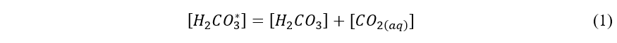
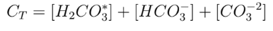
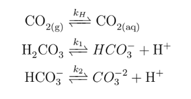
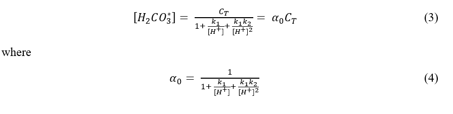
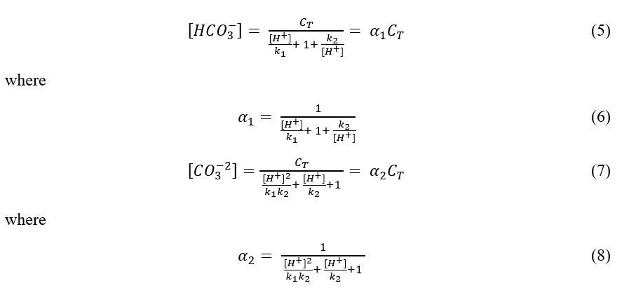
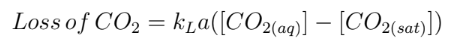
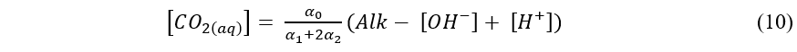
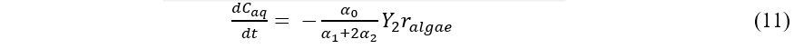
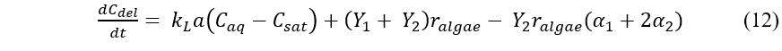

# Carbonate Chemistry Model
The objective of this project is to create a carbonate chemistry model that predicts CO2 losses to the atmosphere and CO2 requirements from algae raceway ponds. It is funded by the U.S. Department of Energy.

## Table of Contents
* [Revelant Information and Equations](#relevant-information-and-equations)
* [Technologies](#technologies)
* [Usage](#usage)
* [Output of Each File](#output-of-each-file)
* [Authors](#authors)

## Relevant Information and Equations
In most natural systems, acid buffering capacity is predominately made up by the carbonate system, which consists of four species - dissolved carbon dioxide, carbonic acid, bicarbonate and carbonate. Carbonic acid exists in only very small quantities and to simplify we define it as follows:

 

CT is defined as the total concentration of carbonate species in solution:

 

In addition, the carbonate species are related to each other through the following equilibrium relationships:



the molar concentration of each carbonate species is dependent on pH as shown below:

 


 


Mass transfer of carbon dioxide is a function of alkalinity and pH, based on the following equation:



Dissolved carbon dioxide concentration can be calculated as follows:

 

The effect of pH, alkalinity, and algal growth rates on carbon dioxide requirements and losses to the atmosphere were modeled for a raceway pond and operated in batch mode for 4 days. A mass balance on alkalinity and the aqueous concentration of carbon dioxide results in the following equation:

 

A mass balance on Ct and rearranging results in the following equation for carbon dioxide requirements:



*excerpted from Sills' 2013 report*
## Technologies
This project is created with:
* MATLAB version: R2020a
* Python version: 3.7 
* Anaconda package with numpy and matplotlib

## Usage
To run this project, you can:
1. To clone with HTTPS, click on:


 
2. clone using git:
```
git clone https://github.com/rkd006/Carbonate-Chemistry-Model

```

## Output of Each File
### MATLAB:
- calc_alpha0: creates a function to calculate alpha0  
- calc_alpha1: creates a function to calculate alpha1
- calc_alpha2: creates a function to calculate alpha2
- calc_alphas: calculate CO2 losses to the atmossphere numerically
- calc_CO2_loss: creates a function to calculate the CO2 losses to the atmosphere with inputs of pH and alkalinity ranges
- calc_CO2_loss_kLa: creates a function to calculate the CO2 losses to the atmosphere with inputs of pH and kLa ranges
- calc_K1: creates a function to calculate K1
- calc_K2: creates a function to calculate K2
- calc_Kh: creates a function to calculate Kh
- calc_CO2_loss_alk: creates a function to calculate the CO2 losses to the atmosphere with inputs of kLa and alk ranges
- plot_carbonates: figure that plots the distribution of carbonate species (H2CO3*, HCO3, CO3)
- rates: creates a function to calculate the system of ODEs

#### *with algal growth:*

- CO2_loss_algal_growth_alk: multiple figures that plot CO2 requirements and losses over four days at several alkalinites for different kLa values
- CO2_loss_algal_growth_kLa: figure that plots CO2 requirements and losses over four days for several kLa values
- CO2_loss_algal_growth_pH: figure that plots CO2 requirements and losses over four days for several pHs
- CO2_loss_algal_growth_range: figure that plots CO2 requirements and losses over four days for several algal growth rates
- CO2_loss_dynamic: figure that plots CO2 requirements and losses over four days and figure that plots CO2 concentration over four days

#### *without algal growth:*

- CO2_loss_kLa_comb: multiple figures that plot CO2 losses to the atmosphere at different alkalinities and pHs for different kLa values
- CO2_loss_kLa_simple: figure that plots CO2 losses to the atmopshere for different alkalinities and figure that plots CO2 losses to the atmosphere for different pHs
- CO2_loss_range_kLa: figure that plots CO2 losses to the atmosphere at different kLa values and pHs
- CO2_loss_script: figure that plots CO2 losses to the atmosphere at different alkalinities and pHs

### Python:
*updated recently*
*see MATLAB files outputs above for replicates if not stated below*

- calc_[inorganiccarbon]_pond: calculates inorganic carbon concentration in the pond at four days numerically and figure that plots the inorganic carbon concentration over four days
- calc_algaecarbon: calculates the carbon concentration in algae at four days numerically 
- calc_alphas: creates functions to calculate alpha0, alpha1, alpha2
- calc_Ks: creates functions to calculate K1, K2, Kh
- CO2_loss_dynamic_y3: figure that plots CO2 requirements and losses over four days and figure that plots CO2 concentration over four days for a combined y3 
- subplot_kLa_comb: creates multiple subplots side by side of the figures of kLa = 0.5 1/hr and kLa = 3 1/hr from CO2_loss_kLa_comb

## Authors
- Deborah Sills
  - Assistant Professor in the Civil and Environmental Engineering Department at Bucknell University
  - [her website](https://deborahsills.com/)
- Riley Doyle
  - Undergraduate Student at Bucknell University, majoring in environmental engineering and graduating in 2022
  - [contact email](rkd006@bucknell.edu)
  - [LinkedIn](https://www.linkedin.com/in/riley-doyle-591565196/)


